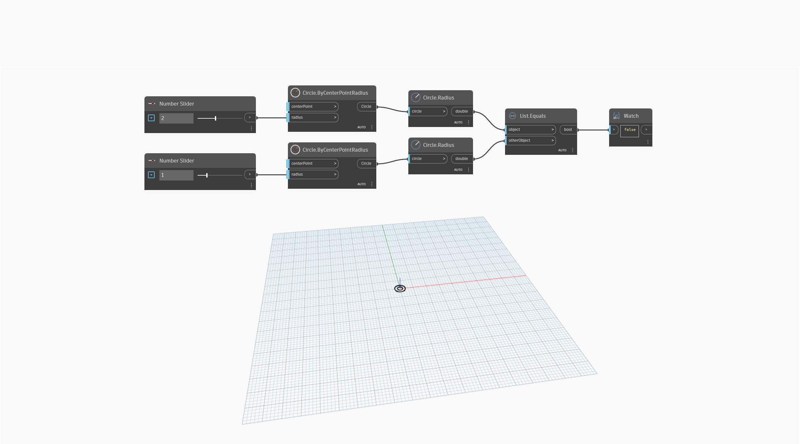

## Подробности
`List.Equals` возвращает логическое значение True, если входные объекты одинаковы.

В примере ниже сравниваются радиусы (двойные целые числа) двух окружностей. Если регуляторы чисел имеют разные значения, `List.Equals` возвращает False. Если два значения равны, `List.Equals` возвращает True.
___
## Файл примера

