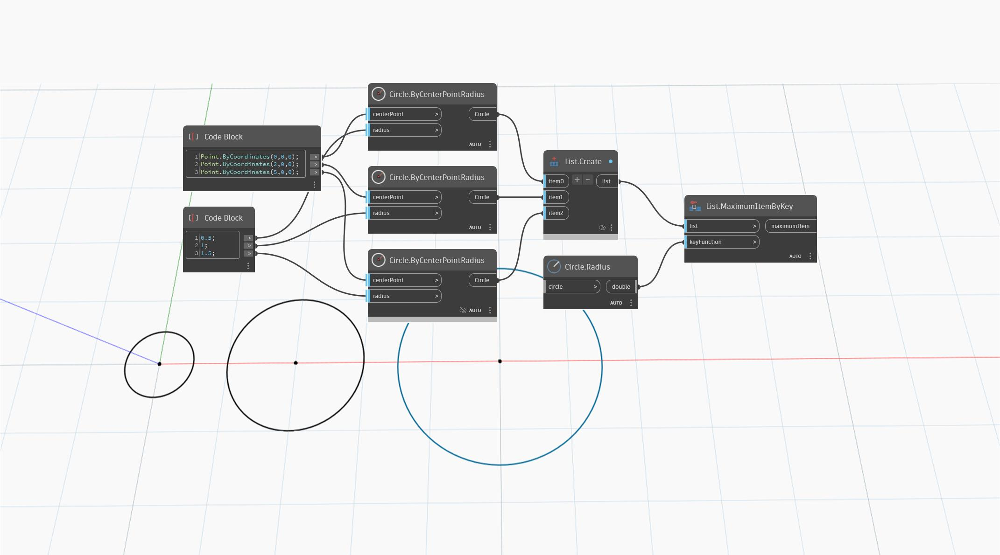

## Подробности
`List.MaximumItemByKey` возвращает наибольший элемент в списке на основе ключевой функции.

В примере ниже ряд из трех окружностей с возрастающими радиусами сравнивается по радиусу в качестве ключа. Возвращается окружность в (5,0,0), так как она имеет наибольший радиус.
___
## Файл примера

