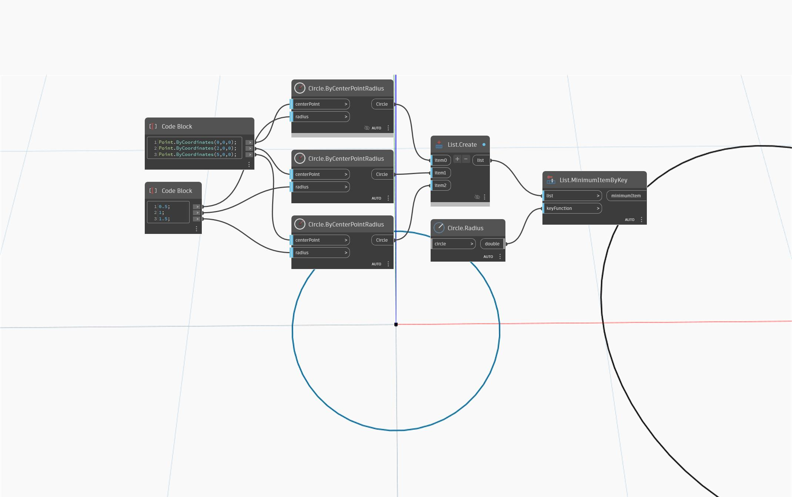

## Подробности
`List.MinimumItemByKey` возвращает наименьший элемент в списке на основе ключевой функции.

В примере ниже ряд из трех окружностей с возрастающими радиусами сравнивается по радиусу в качестве ключа. Возвращается окружность в начале координат, так как она имеет наименьший радиус.
___
## Файл примера

