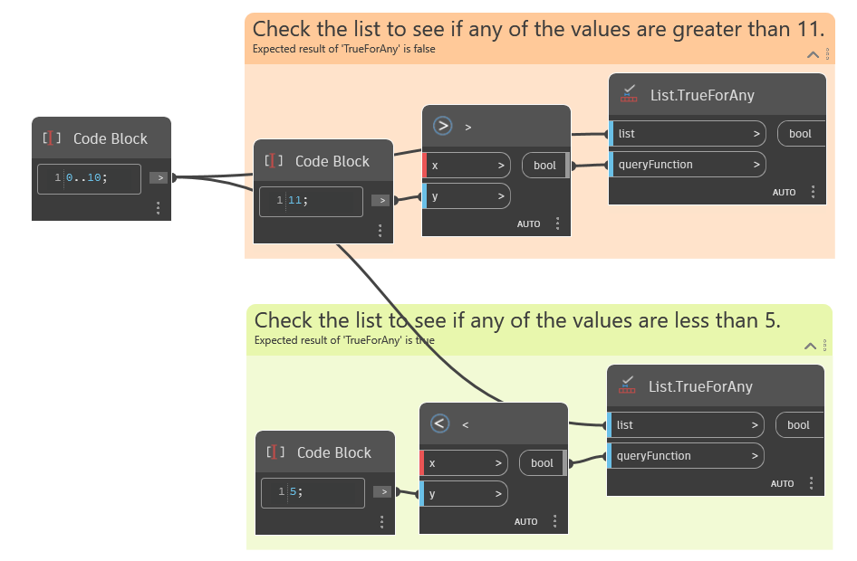

## Подробности
`List.TrueForAny` возвращает логическое значение, которое указывает, имеет ли условие во входном параметре `queryFunction` значение True по крайней мере для одного элемента из списка. Параметр `queryFunction` должен являться логическим значением.

В примере ниже показаны две функции, используемые для обработки входного списка. В первой используется узел «больше чем» (>) для определения того, являются ли хотя бы одно значение в списке больше 11. Возвращается значение False. Во второй используется узел «меньше чем» (<) для определения того, являются ли хотя бы одно значение в списке меньше 5. Возвращается значение True.
___
## Файл примера

