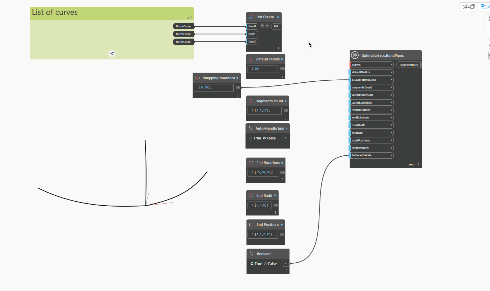

## In-Depth
Узел `TSplineSurface.BuildPipes` создает трубчатую Т-сплайновую поверхность с использованием сети кривых. Отдельные трубы считаются соединенными, если их конечные точки находятся в пределах максимального допуска, определяемого входным параметром `snappingTolerance`. Результат, возвращаемый этим узлом, можно настроить с помощью набора входных параметров, которые позволяют задавать значения для всех труб сразу или для каждой по отдельности, если входной параметр представляет собой список, длина которого равна количеству труб. Таким образом можно использовать следующие входные параметры: `segmentsCount`, `startRotations`, `endRotations`, `startRadii`, `endRadii`, `startPositions` и `endPositions`.

В приведенном ниже примере три кривые, соединенные в конечных точках, используются в качестве входных параметров для узла `TSplineSurface.BuildPipes`. Значение `defaultRadius` в этом случае задает радиус по умолчанию для всех трех труб, если не указаны начальный и конечный радиусы.
Затем с помощью параметра `segmentsCount` задаются три различных значения для каждой отдельной трубы. Входные данные представляют собой список из трех значений, каждое из которых соответствует трубе.

Дополнительные настройки становятся доступны, если для параметров `autoHandleStart` и `autoHandleEnd` задано значение False. Это позволяет определить начальный и конечный повороты каждой трубы (входные параметры `startRotations` и `endRotations`), а также радиусы в начале и в конце каждой трубы путем задания параметров `startRadii` и `endRadii`. Параметры `startRotations` и `endRotations` задают смещение сегментов в начале или конце каждой кривой соответственно. Для этих входных параметров необходимо задать значения, соответствующие параметрам кривой в начале или конце сегмента (значения от 0 до 1).

## Файл примера

