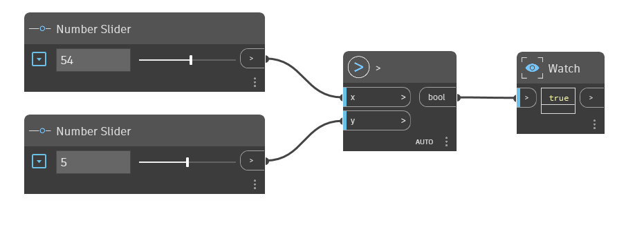

## Подробности
Узел «>» является оператором «Больше». Если входное значение «x» больше входного значения «y», он возвращает значение «Истина». Если значение «x» меньше значения «y» или если эти два значения равны, возвращается значение «Ложь». В примере ниже узел «>» используется для определения того, больше ли входное значение «x» чем входное значение «y». Для управления входными данными для оператора «>» используются два регулятора числовых значений.
___
## Файл примера

