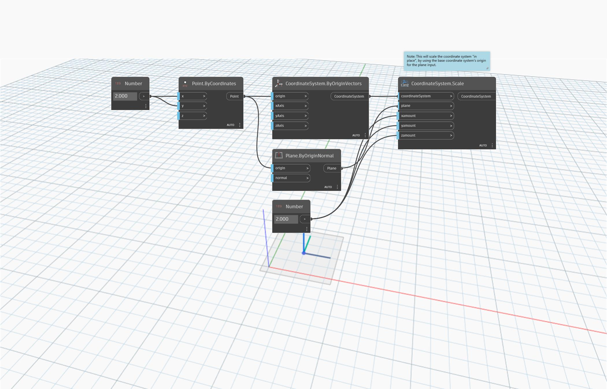

<!--- Autodesk.DesignScript.Geometry.CoordinateSystem.Scale(coordinateSystem, plane, xamount, yamount, zamount) --->
<!--- NE2FY5VUCEZ5FDNQJAZD74HKN3WQSOQJXNOQ77SK3PFIJQCTF23Q --->
## Подробности
`CoordinateSystem.Scale (coordinateSystem, plane, xamount, yamount, zamount)` масштабирует систему координат неравномерно вокруг заданной плоскости. Система координат масштабируется по месту с использованием начала базовой системы координат для входного значения plane.
___
## Файл примера

