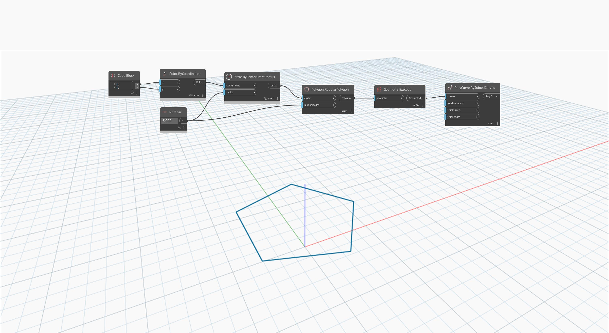

<!--- Autodesk.DesignScript.Geometry.PolyCurve.ByJoinedCurves(curves, joinTolerance, trimCurves, trimLength) --->
<!--- NHC5UY7UTB4NA5X3EXEIVOE3EOF7CFAXOVVAHYJ7ZSKC76OLPPYA --->
## Подробности
`PolyCurve.ByJoinedCurves` создает объединенные кривые из набора кривых с соответствующими вершинами. Можно определить допустимый размер зазора между соединяемыми кривыми с помощью входного значения `joinTolerance`.

В примере ниже объект `Polygon.RegularPolygon` расчленяется на список кривых, а затем снова объединяется в объект PolyCurve.
___
## Файл примера

