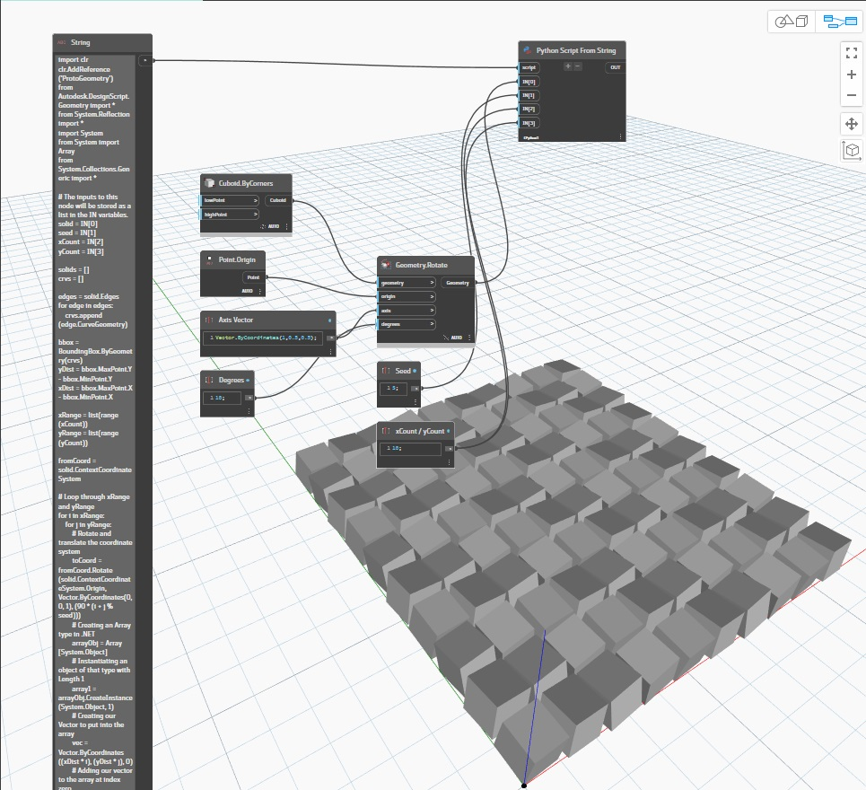

## Подробности
Узел Python Script From String возвращает результат передачи входных элементов узла в строковый сценарий Python. В приведенном ниже примере сценарий Python извлекается из узла String. Куб, созданный с помощью узла Cuboid.ByCorners, преобразуется в массив сценарием Python, который циклически проходит и через X, и через Y.
___
## Файл примера

