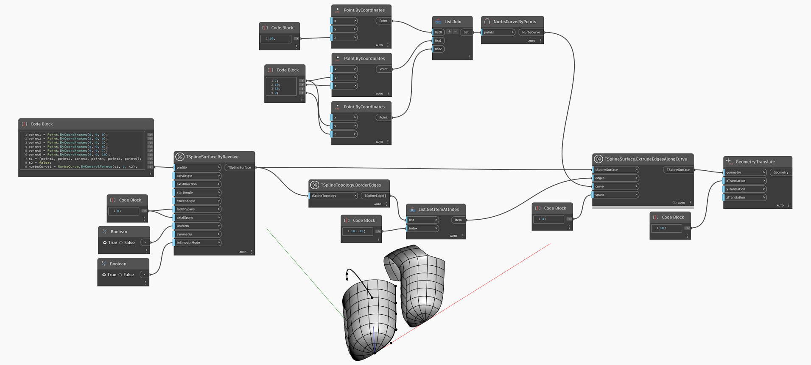

<!--- Autodesk.DesignScript.Geometry.TSpline.TSplineSurface.ExtrudeEdgesAlongCurve --->
<!--- RJA3JYUP36W2AR37ZYMWTK2ZDSFS6YXA5LMXE5CAYOZZDO6754CQ --->
## Подробности
В приведенном ниже примере выбирается набор ребер границ Т-сплайновой поверхности, после чего используется в качестве входного параметра для узла `TSplineSurface.ExtrudeEdgesAlongCurve`. Результат смещается в сторону для удобства предварительного просмотра.
___
## Файл примера

