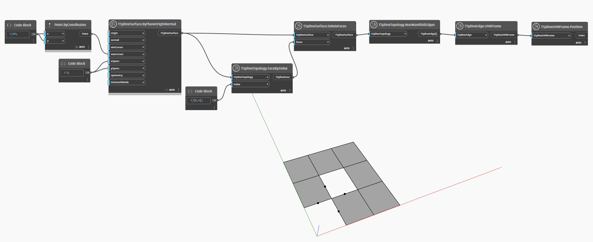

<!--- Autodesk.DesignScript.Geometry.TSpline.TSplineTopology.NonManifoldEdges --->
<!--- RTIWDKESEBH6BZLFB4NRIVBLFZ72VYNZW4TBWEI6EEYG22TE6NBA --->
## In-Depth
 Узел `TSplineTopology.NonManifoldEdges` определяет неоднородные ребра на Т-сплайновой поверхности. Неоднородная поверхность может отображаться только в режиме рамки до тех пор, пока не будет восстановлена.

В приведенном ниже примере неоднородная Т-сплайновая поверхность создается в результате удаления граней на плоской поверхности. Для определения и визуализации неоднородных ребер используются узлы `TSplineTopology.NonManifoldEdges` и `TSplineUVNFrame.Position`.

## Файл примера

