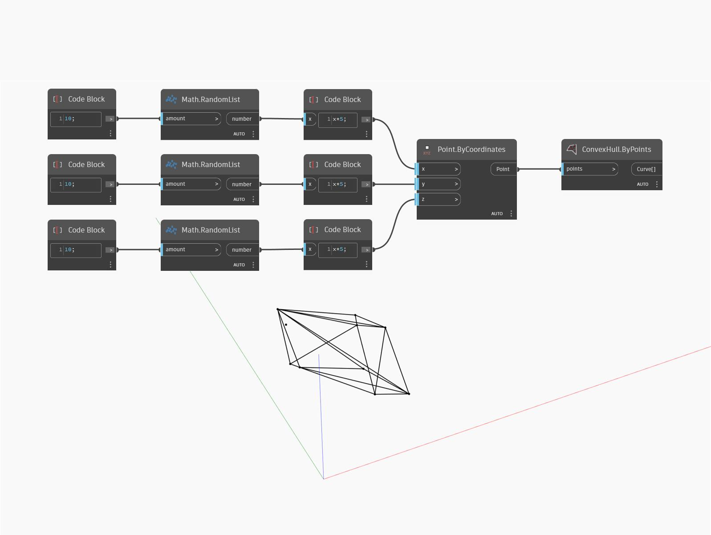

## Подробности
`ConvexHull.ByPoints` возвращает список кривых, представляющих выпуклую оболочку набора точек.

В примере ниже список точек, случайным образом размещенных в 3D, возвращает список кривых, представляющих выпуклую оболочку.

___
## Файл примера

