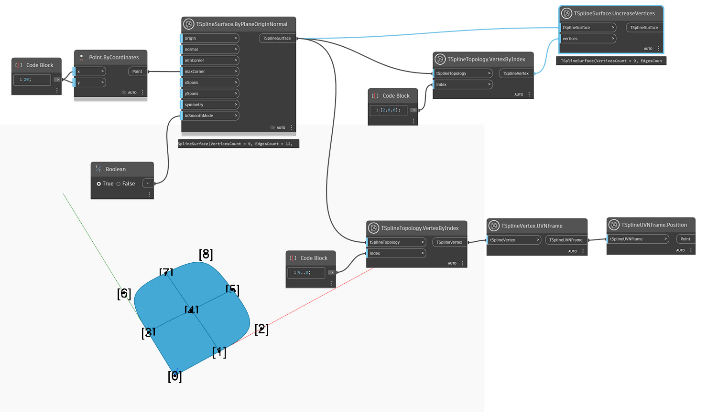

<!--- Autodesk.DesignScript.Geometry.TSpline.TSplineSurface.UncreaseVertices --->
<!--- UCHS6CZOTWQLL24MRS4TPZS4UDBURP3SZIIW4TRSPQVRTMYBAVVA --->
## In-Depth
В приведенном ниже примере узел `TSplineSurface.UncreaseVertices` применяется к угловым вершинам плоского примитива. По умолчанию эти вершины сгибаются в момент создания поверхности. Вершины определяются с помощью узлов `TSplineVertex.UVNFrame` и `TSplineUVNFrame.Poision` с активированным параметром `Show Labels`. Затем угловые вершины выбираются с помощью узла `TSplineTopology.VertexByIndex` и разгибаются. Эффект этого действия можно просмотреть, если для формы выбран предварительный просмотр в режиме сглаживания.

## Файл примера

