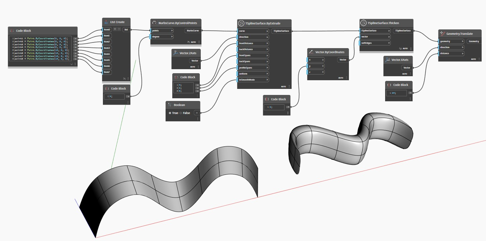

## Подробности
Узел `TSplineSurface.Thicken(vector, softEdges)` утолщает Т-сплайновую поверхность, направляемую заданным вектором. Операция утолщения копирует поверхность в направлении, задаваемом параметром `vector`, а затем соединяет две поверхности путем соединения их ребер. Логический входной параметр `softEdges` определяет, сглаживаются ли (True) или сгибаются (False) итоговые ребра.

В приведенном ниже примере выдавленная Т-сплайновая поверхность утолщается с помощью узла `TSplineSurface.Thicken(vector, softEdges)`. Итоговая поверхность смещается в сторону для удобства визуализации.

___
## Файл примера

