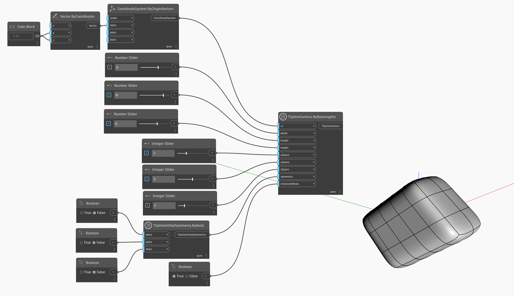

<!--- Autodesk.DesignScript.Geometry.TSpline.TSplineSurface.ByBoxLengths(cs, width, length, height, xSpans, ySpans, zSpans, symmetry, inSmoothMode)
<!--- VFK33PBU2AHJIHDOMW3NS2YJNGRTQADZ2RUGALOLEWRXK4DM4DTA --->
## In-Depth
Узел `TSplineSurface.ByBoxLengths(cs, width, length, height, xSpans, ySpans, zSpans, symmetry, inSmoothMode)` создает Т-сплайновую поверхность рамки по заданной системе координат `cs`. Размеры поверхности определяются входными параметрами `width`, `length` и `height`, а также количеством пролетов по осям X, Y и Z в каждом направлении. Параметры симметрии можно задать с помощью входного параметра `symmetry`. Логический входной параметр `inSmoothMode` используется для переключения между режимами сглаживания и рамки.

## Файл примера

