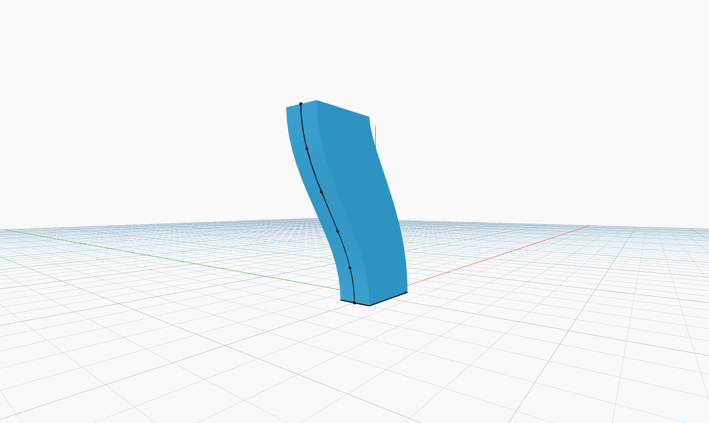

<!--- Autodesk.DesignScript.Geometry.Solid.BySweep(profile, path, cutEndOff) --->
<!--- X65A3XAWWVM3XWMAZHZFLL5HTXCJAGYISLC4VHRMPHEV3MBYIRXQ --->
## Подробности
`Solid.BySweep` создает тело путем сдвига входной кривой замкнутого профиля вдоль заданной траектории.

В примере ниже в качестве базовой кривой профиля используется прямоугольник. Траектория создается с помощью косинусной функции с последовательностью углов для изменения координат X набора точек. Точки используются в качестве входных данных для узла `NurbsCurve.ByPoints`. Затем создается тело путем сдвига прямоугольника вдоль созданной косинусоиды.
___
## Файл примера

