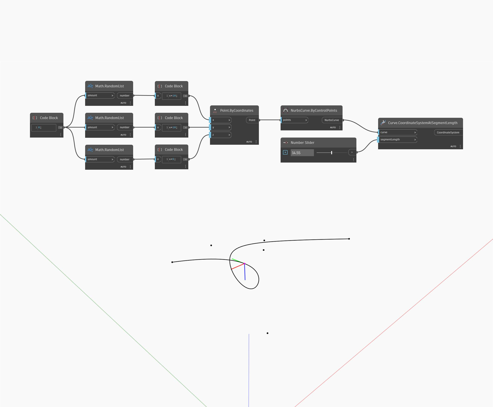

<!--- Autodesk.DesignScript.Geometry.Curve.CoordinateSystemAtSegmentLength --->
<!--- ZNPLCTHUSPIP3EMDAM4IGJTCBFMOVDXMVS2J4XSXYSX3WEWBWS5Q --->
## Подробности
CoordinateSystemAtSegmentLength возвращает систему координат, совмещенную с входной кривой в точке, отстоящей от начальной точки кривой на заданную длину. Ось Х результирующей системы координат будет направлена по нормали к кривой, а ось Y — по касательной к кривой в точке, отстоящей от начала кривой на заданную длину. В примере ниже сначала с помощью узла ByControlPoints создается NURBS-кривая, где в качестве входных данных используется набор случайных точек. Для управления входным элементом segmentLength узла CoordinateSystemAtParameter используется числовой регулятор. Если заданная длина превышает длину кривой, этот узел возвращает систему координат в конечной точке кривой.
___
## Файл примера

