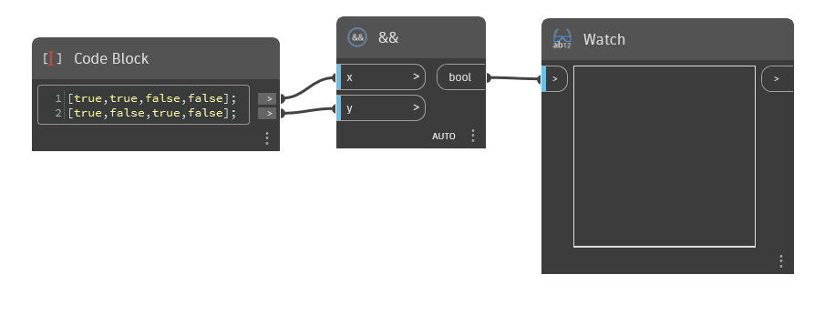

## 详细
`&&` 接受两个布尔值或布尔值列表，并确定两个值是否都为 True。在所有其他情况下，它都返回 False。

在下面的示例中，我们从两个布尔值列表开始。这些列表一起表示 True 和 False 值的 4 种可能组合。`&&` 仅对第一对值返回 True，这两个值都为 True。其他情形是 True 和 False 的组合，或 False 和 False 的组合，所以 `&&` 返回 False。
___
## 示例文件

