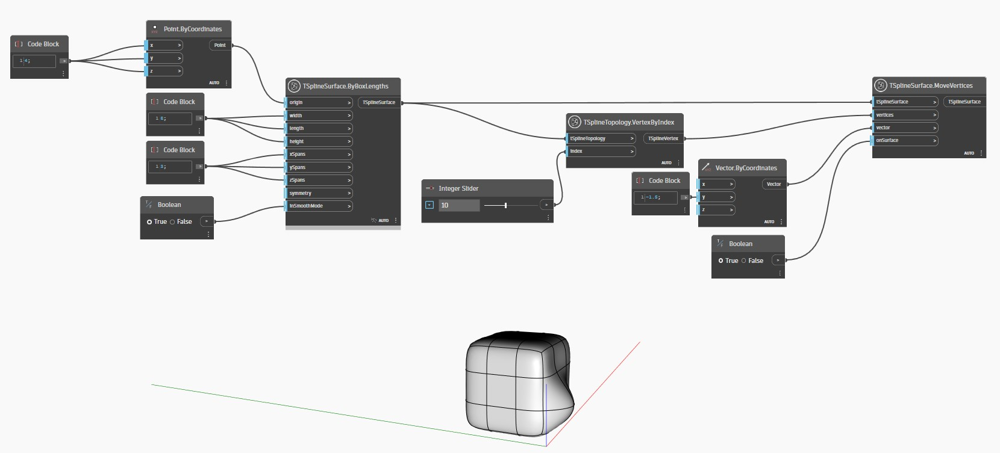

<!--- Autodesk.DesignScript.Geometry.TSpline.TSplineTopology.VertexByIndex --->
<!--- 7LRWGLADXMQPJN33WBBRTYBBK4NO6FQADRQICYVBDCTWPJ3FOONQ --->
## 详细
在下面的示例中，使用 `TSplineTopology.VertexByIndex` 节点收集 T-Spline 曲面的顶点。然后，该顶点将用作 `TSplineSurface.MoveVertices` 节点的输入。
___
## 示例文件

