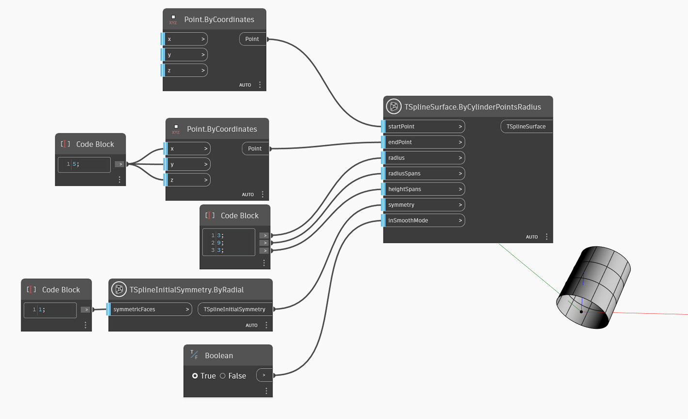

<!--- Autodesk.DesignScript.Geometry.TSpline.TSplineSurface.ByCylinderPointsRadius --->
<!--- AUSALFCUDD62GV5ALRNIDJ43LBF3FWW5HY5WNAQBKRB7E2JF7WUQ --->
## In-Depth
在下面的示例中，将创建 T-Spline 基本体圆柱体曲面。圆柱体的底部和顶部平面由 `startPoint` 和 `endPoint` 输入定义，大小由 `radius` 输入值设置。径向和高度方向上的跨度由 `radiusSpans` 和 `heightSpans` 输入控制。形状的初始对称由 `symmetry` 输入指定。如果 X 或 Y 轴对称设置为 True，则径向跨度的值必须是 4 的倍数。最后，`inSmoothMode` 输入用于在 T-Spline 曲面的平滑模式和长方体模式预览之间切换。

## 示例文件

