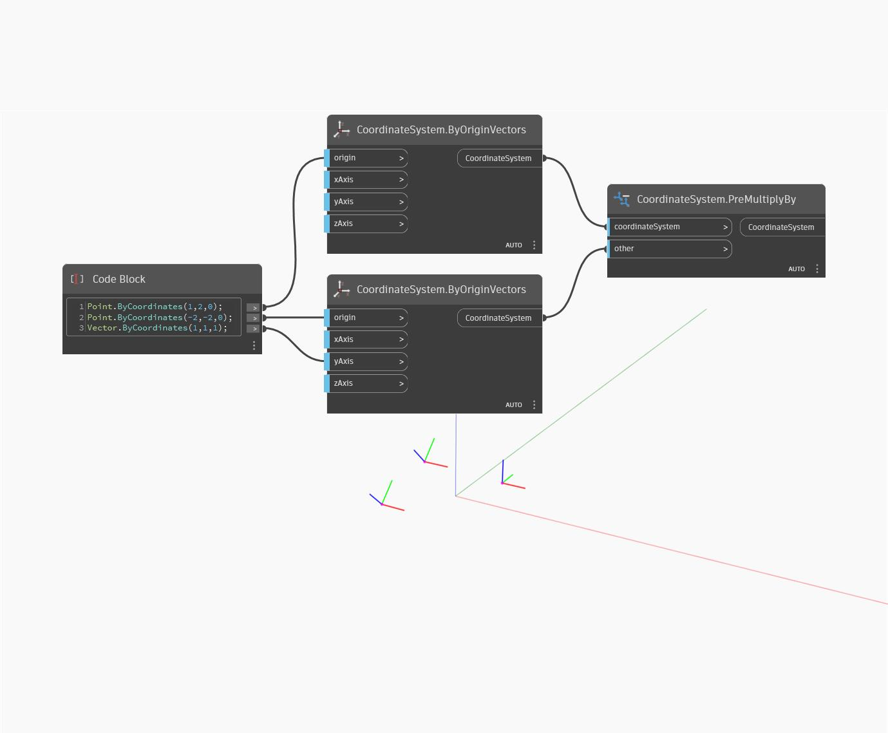

## 详细
“PreMultiplyBy”将通过乘以其他(参数) CoordinateSystem 和一个 CoordinateSystem 来返回一个新的 CoordinateSystem。在下例中，将返回一个新的 CoordinateSystem，该坐标系相对于它乘以的 CoordinateSystem 及其参数进行平移和旋转。此节点与“PostMultiplyBy”节点类似，唯一的区别是在坐标系输入之前应用其他输入。
___
## 示例文件

