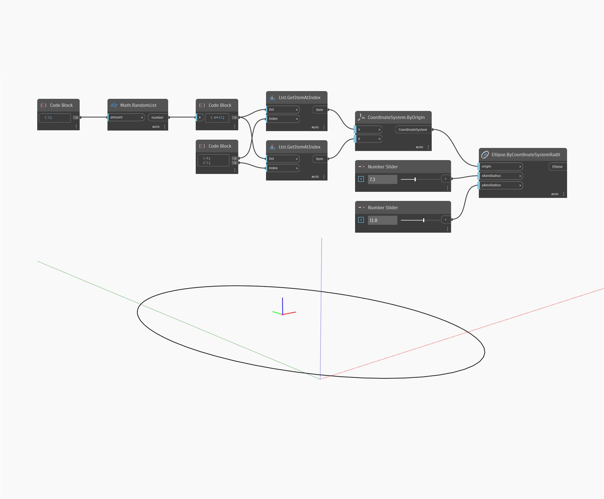

## 详细
“Ellipse by Coordinate System Radii”将坐标系用作输入，然后使用输入的半径创建椭圆。输入的“xAxisRadius”和“yAxisRadius”对应于输入坐标系的 X 和 Y 方向(而不是世界 X 和 Y 轴方向)。在示例文件中，我们生成两个随机值来创建坐标系，然后将该坐标系和两个“数字”滑块一起用于 x 和 y 半径。
___
## 示例文件

