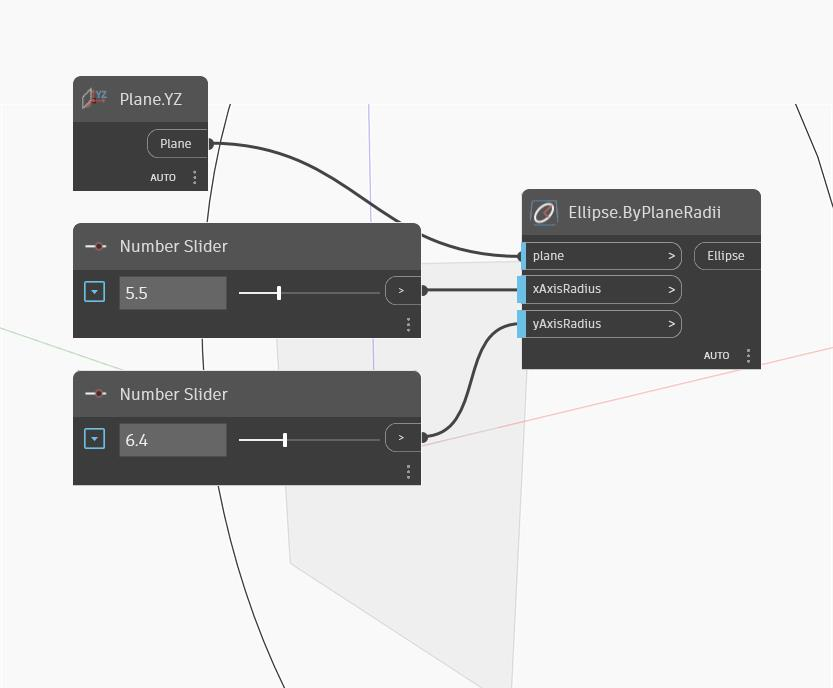

## 详细
“Ellipse by Plane Radii”将创建以输入平面为中心的椭圆。“xAxisRadius”和“yAxisRadius”将数字用作输入，并对应于输入平面的 X 和 Y 方向，这可能不同于世界 X 和 Y 方向。在下例中，我们使用 YZ 平面作为输入，然后将两个“数字”滑块用于“xAxisRadius”和“yAxisRadius”。由于我们使用 YZ 平面，因此输入的“xAxisRadius”将对应于世界 Y 方向，而“yAxisRadius”将对应于世界 Z 方向。
___
## 示例文件

