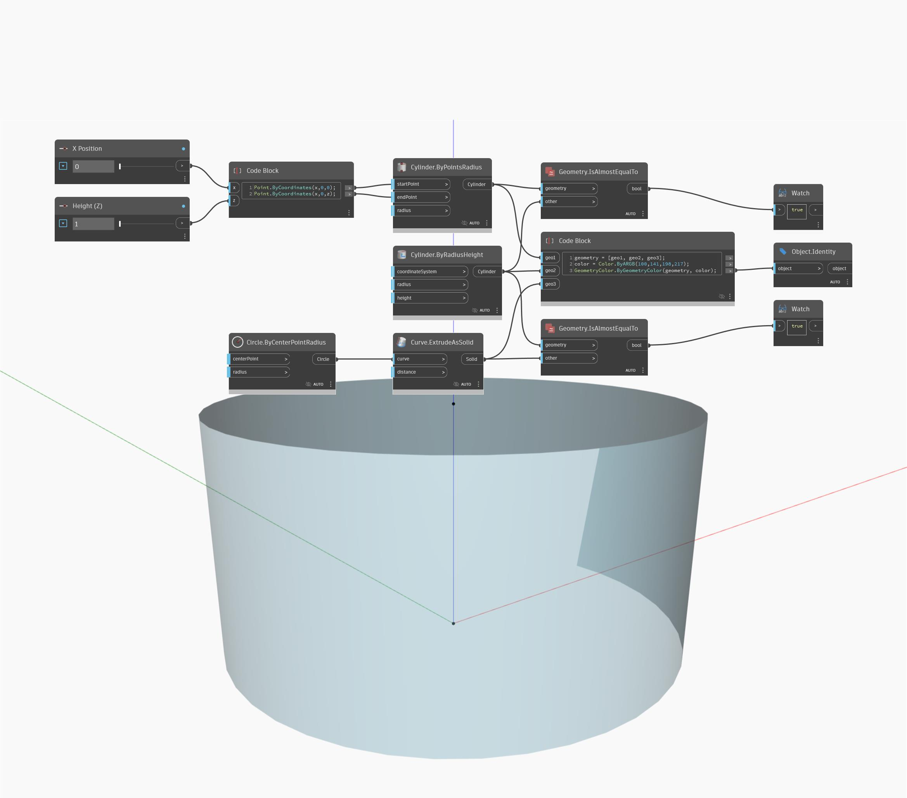

## 详细
`Geometry.IsAlmostEqualTo` returns a boolean value indication whether the two given geometries have the same geometrical representations or numerical values.

In the example below, a cylinder is created two ways. The two cylinders are then compared with `Geometry.IsAlmostEqualTo`.
___
## 示例文件

