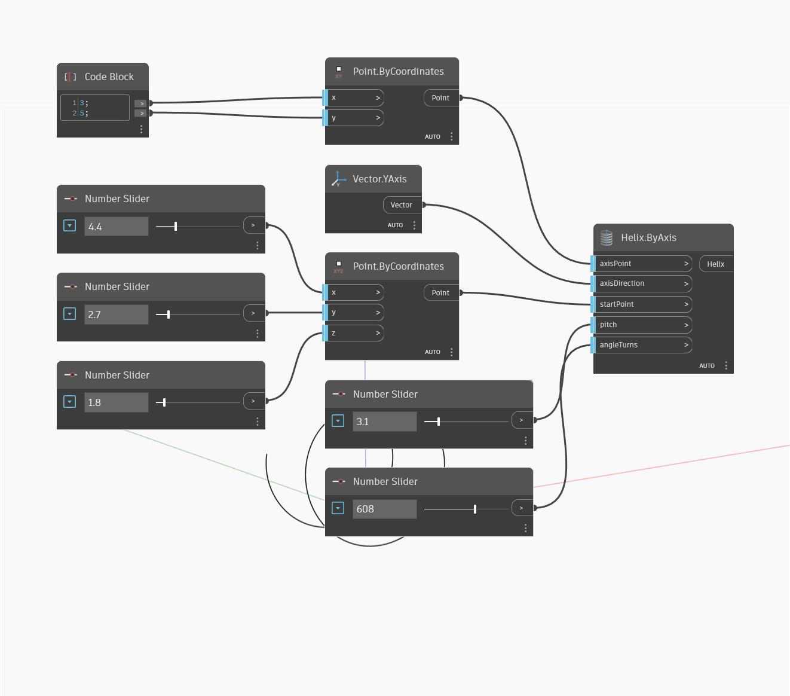

## 详细
“Helix By Axis”将创建螺旋。螺旋的轴由输入的轴点和轴方向定义。螺旋将围绕轴逆时针创建(从起点开始，并以度为单位持续到“Angle Turns”输入的角度长度)。“Pitch”输入确定在轴方向上每 360 度的螺旋距离。在下例中，我们从点(3,5)处开始创建螺旋，并使用 Y 轴定义螺旋轴。螺旋的起点由三个“数字”滑块控制。“pitch”和“angleTurns”使用另外两个“数字”滑块。请注意，“angleTurns”以度为单位。
___
## 示例文件

