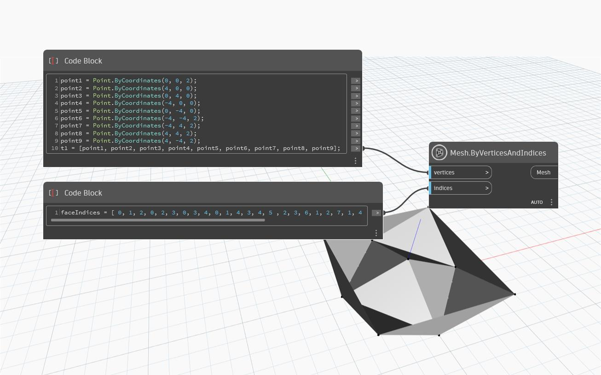

## 详细
“Mesh.ByVerticesIndices”获取表示网格三角形的“vertices”的“Points”列表和表示网格如何缝合在一起的“indices”列表，并创建一个新网格。“vertices”输入应该是网格中唯一顶点的平面列表。“indexes”输入应为整数的平面列表。每组三个整数指定网格中的一个三角形。整数指定顶点列表中顶点的索引。索引输入的索引应为 0 索引，顶点列表的第一个点的索引为 0。

在下面的示例中，“Mesh.ByVerticesIndices”节点用于使用九个“vertices”列表和 36 个“indices”列表创建网格，并为网格的 12 个三角形中的每一个指定顶点组合。

## 示例文件

