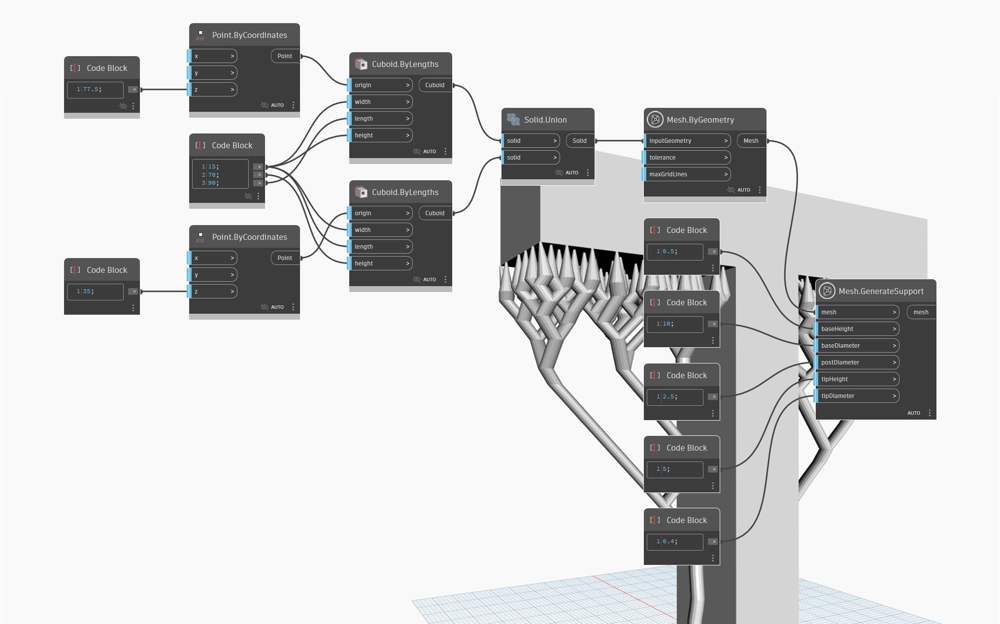

## 详细
“Mesh.GenerateSupport”节点用于向输入网格几何图形添加支撑，以便为三维打印做好准备。要成功打印具有悬挑的几何形状，需要提供支撑，以确保适当的层附着力并防止材料在打印过程中下垂。'Mesh.GenerateSupport' 检测悬垂结构并自动生成树型支撑，这些支撑消耗的材料更少，更容易移除，与打印表面的接触更少。在未检测到悬垂结构的情况下，“Mesh.GenerateSupport”节点的结果与网格相同，经过旋转并进入打印的最佳取向，并平移到 XY 平面。支撑的配置由输入控制:
- baseHeight - 定义支撑最低部分(其底部)的厚度
- baseDiameter 控制支撑底部的大小
- postDiameter 输入控制中间每个支撑的大小
- tipHeight 和 tipDiameter 控制顶端与打印表面接触的支撑尺寸
在下面的示例中，“Mesh.GenerateSupport”节点用于向字母“T”形状的网格添加支撑。

## 示例文件

