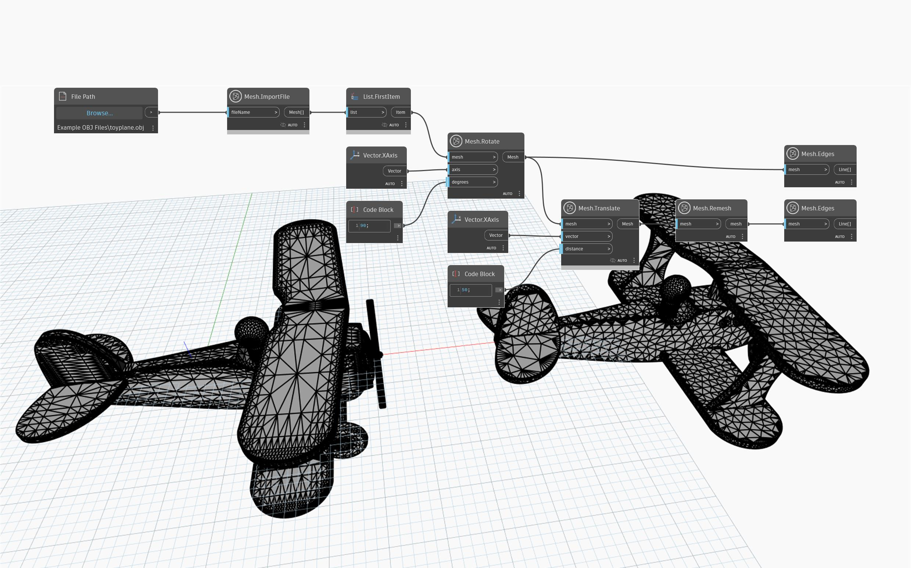

## 详细
“Mesh.Remesh”创建一个新网格，其中给定对象中的三角形将更均匀地重新分布，而不管三角形法线如何变化。此操作对于具有可变三角形密度的网格非常有用，以便为强度分析准备网格。重复重新划分网格将生成逐渐更均匀的网格。对于顶点已经等距的网格(例如，icosphere 网格)，“Mesh.Remesh”节点的结果就是同一个网格。
在下面的示例中，“Mesh.Remesh”用于在细节精细的区域中具有高密度三角形的导入网格。“Mesh.Remesh”节点的结果将平移到侧面，并且“Mesh.Edges”用于可视化结果。

`(使用的示例文件已获得 Creative Commons 许可)`

## 示例文件

