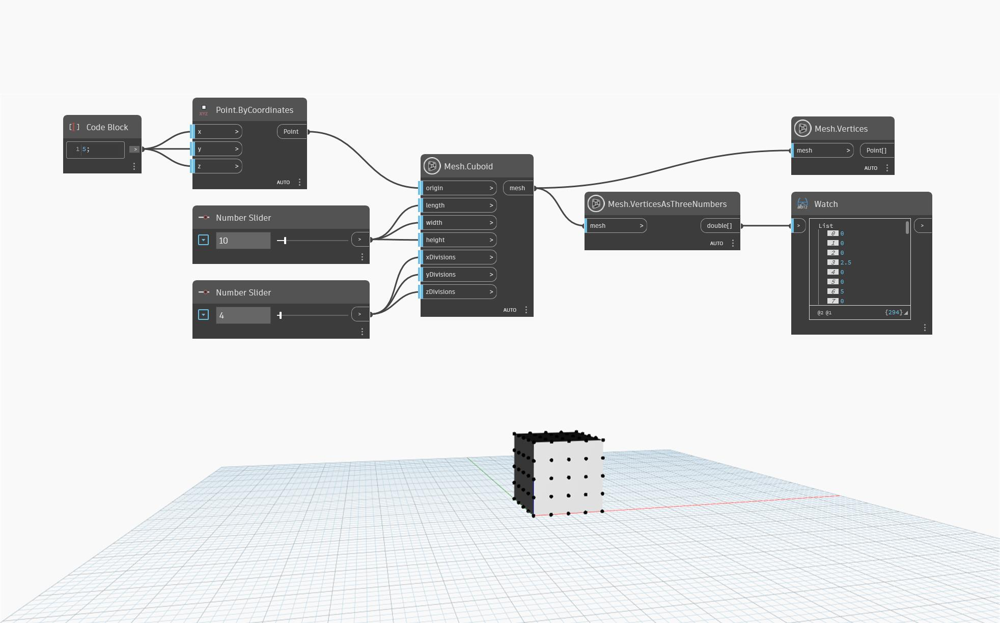

## 详细
“Mesh.VerticesAsThreeNumbers”确定所提供网格中顶点的 X、Y 和 Z 坐标，因此每个顶点生成三个数字。在下面的示例中，“Mesh.Cuboid”和“Number.Slider”用于创建一个立方体网格，然后将其用作确定每个顶点坐标的输入。除此之外，“Mesh.Vertices”用于报告每个顶点的坐标列表，以及在预览中显示顶点。如示例所示，“Mesh.VerticesAsThreeNumbers”报告的值将是“Mesh.VertexCount”值的三倍。

## 示例文件

