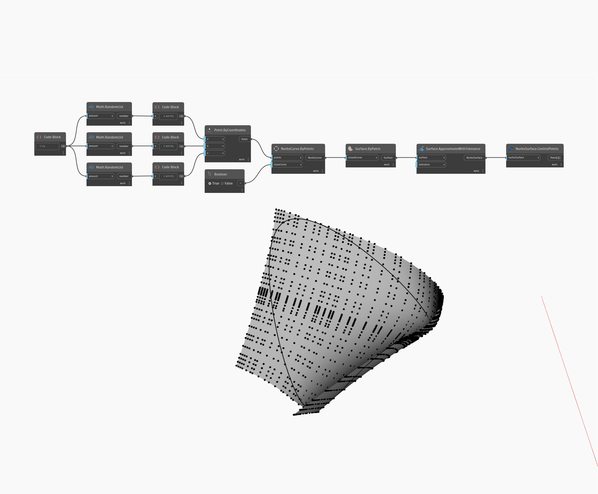

## In Depth
ControlPoints will return the ControlPoints of a NurbsSurface as Points in a List of Lists. In the example below, the ControlPoints are returned from a NurbsSurface created from a Patch.
___
## Example File

