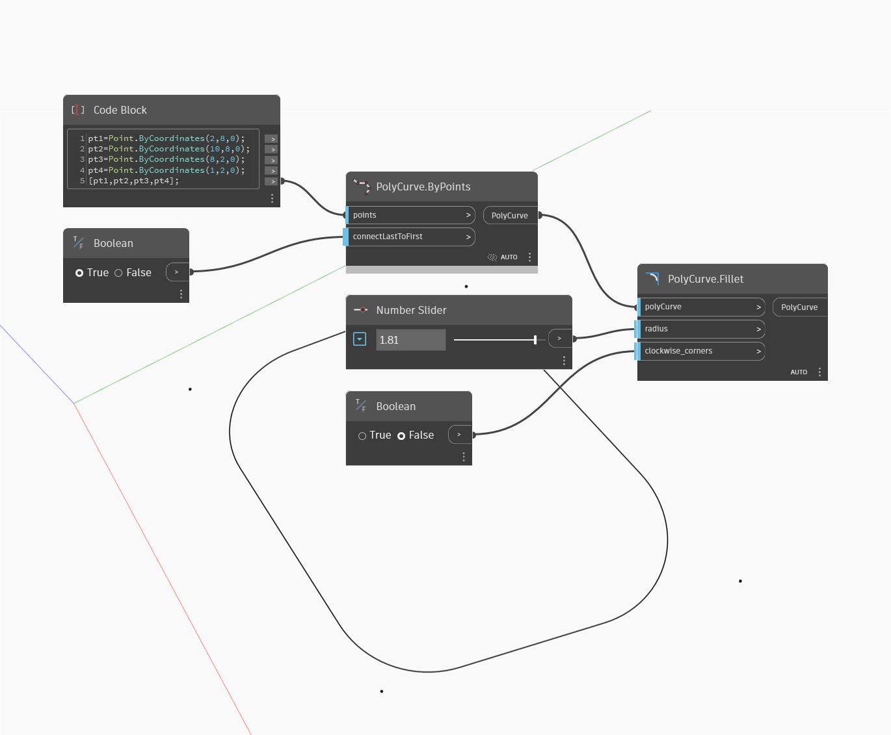

## 详细
“Fillet”将返回一个带有圆角边的新实体。边输入指定要圆角的边，而偏移输入确定圆角的半径。在下例中，我们从使用默认输入的立方体开始。为了获得立方体的相应边，我们先分解立方体以获得作为曲面列表的面。然后，我们使用“Face.Edges”节点提取立方体的边。我们使用“GetItemAtIndex”提取每个面的第一条边。一个“数字”滑块控制每个圆角的半径。
___
## 示例文件

