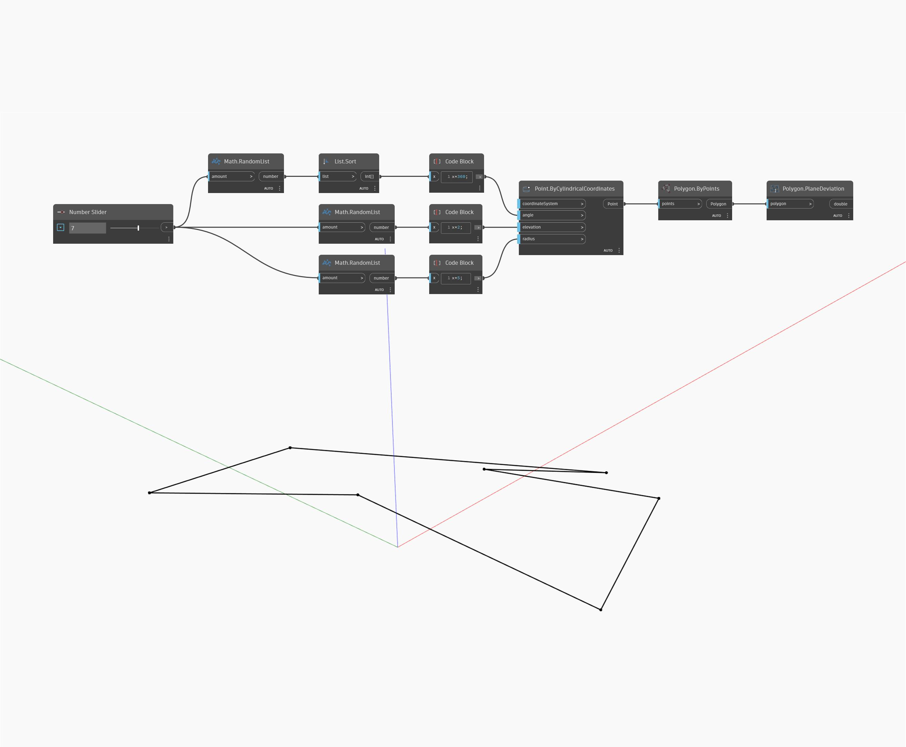

## 详细
“Plane Deviation”将先通过给定多边形的点计算最佳拟合平面。然后，它计算每个点到该平面的距离，以查找点与最佳拟合平面的最大偏差。在下例中，我们生成随机角度、高程和半径的列表，然后使用“Points By Cylindrical Coordinates”创建一组非平面点以用于“Polygon By Points”。通过将该多边形输入给“PlaneDeviation”，我们可以查找点与最佳拟合平面的平均偏差。
___
## 示例文件

