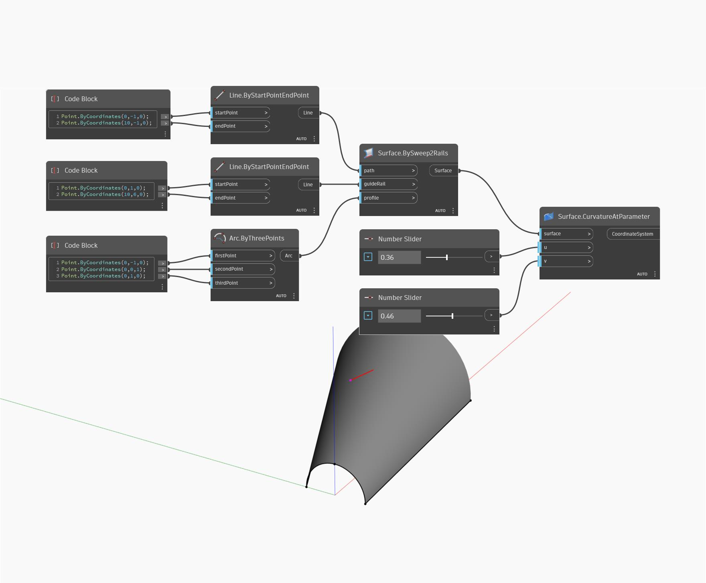

## 详细
“Curvature At Parameter”将使用 U 和 V 输入参数，并根据曲面上 UV 位置处的法线、U 方向和 V 方向而返回一个坐标系。法线向量确定 Z 轴，而 U 和 V 方向确定 X 轴和 Y 轴的方向。轴的长度由 U 和 V 曲率确定。在下例中，我们先使用“BySweep2Rails”创建一个曲面。然后，我们使用两个“数字”滑块来确定 U 和 V 参数，以使用“CurvatureAtParameter”节点创建一个坐标系。
___
## 示例文件

