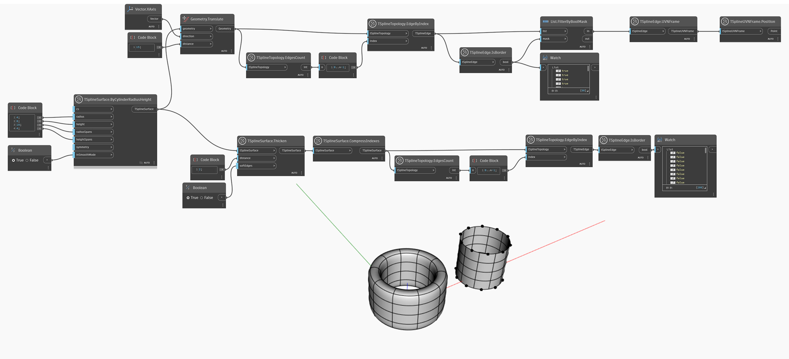

## In-Depth
如果输入的 T-Spline 边是边界，则 `TSplineEdge.IsBorder` 返回 `True`。

在下面的示例中，将研究两个 T-Spline 曲面的边。曲面是圆柱体及其加厚版本。要选择所有边，在这两种情况下都使用 `TSplineTopology.EdgeByIndex` 节点，并输入索引 - 一个从 0 到 n 的整数范围，其中 n 是 `TSplineTopology.EdgesCount` 提供的边数。这是使用 `TSplineTopology.DecomposedEdges` 直接选择边的替代方法。`TSplineSurface.CompressIndices` 还用于加厚圆柱体的情况，以重新排序边索引。
`TSplineEdge.IsBorder` 节点用于检查哪些边是边界边。平面圆柱体的边界边位置借助 `TSplineEdge.UVNFrame` 和 `TSplineUVNFrame.Position` 节点亮显。加厚圆柱体没有边界边。

## 示例文件

