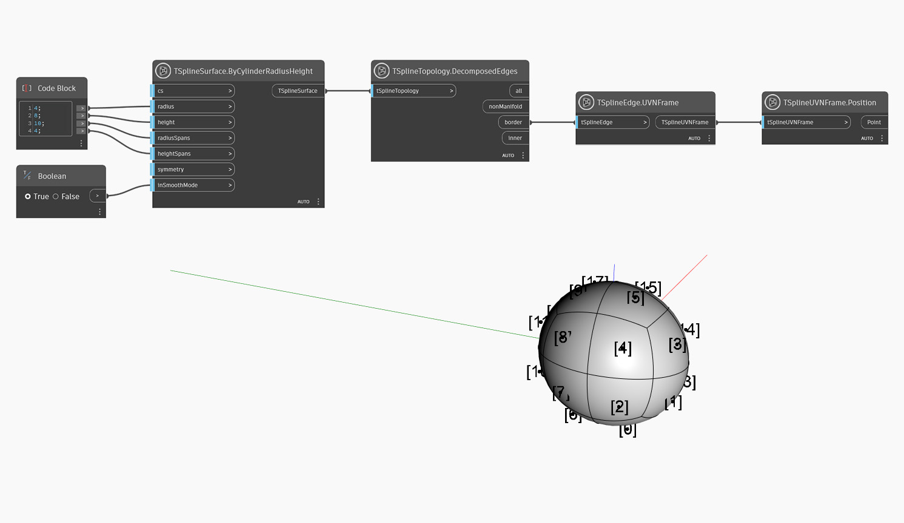

## In-Depth
面的 UVNFrame 通过返回法线向量和 UV 方向，来提供有关面位置和方向的有用信息。
在下面的示例中，`TSplineFace.UVNFrame` 节点用于可视化四分球基本体上面的分布。`TSplineTopology.DecomposedFaces` 用于查询所有面，然后 `TSplineFace.UVNFrame` 节点用于将面质心的位置检索为点。使用 `TSplineUVNFrame.Position` 节点可视化这些点。通过在节点的右键单击菜单中启用“显示标签”，标签将显示在背景预览中。

## 示例文件

