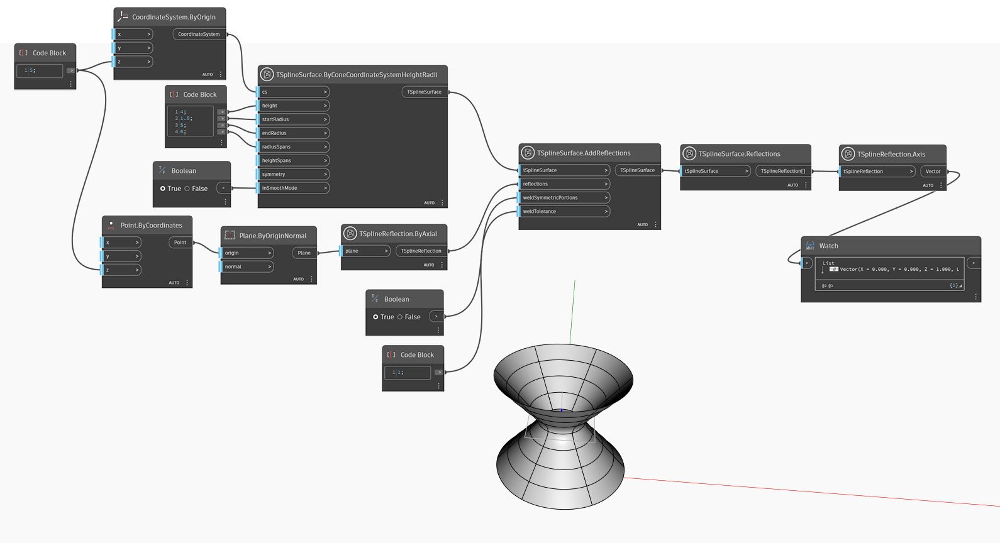

## In-Depth
`TSplineReflection.Axis` 返回一个向量值，该值表示 T-Spline 反射所围绕的轴。

在下面的示例中，将使用添加的反射创建 T-Spline 曲面。在直线下方进一步使用 `TSplineSurface.Reflections` 查询已应用于曲面的反射。然后，`TSplineReflection.Axis` 用于返回表示反射轴的向量。

## 示例文件

