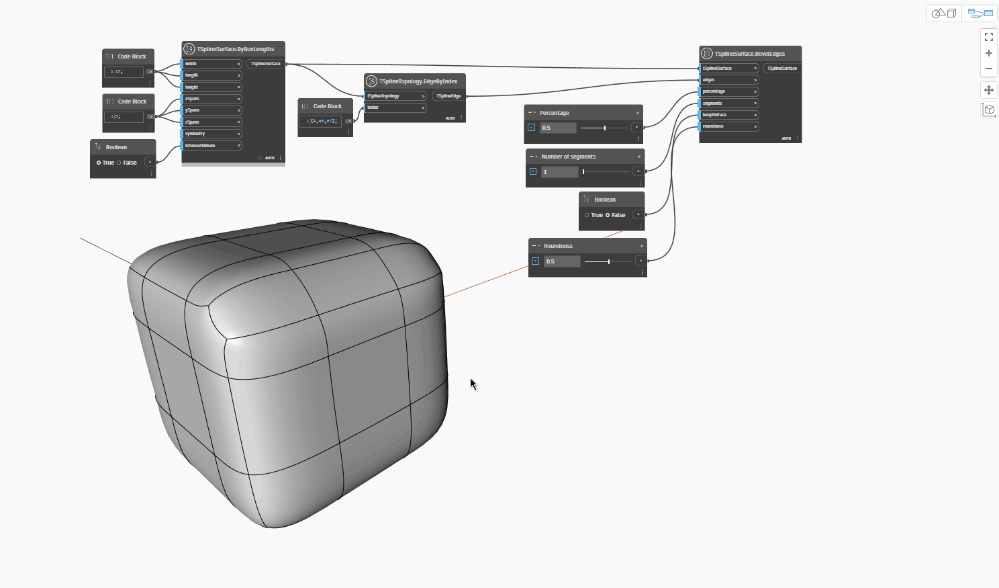

## In-Depth
`TSplineSurface.BevelEdges` 节点沿面在两个方向上偏移选定边或一组边，以将原始边替换为形成通道的一系列边。

在下面的示例中，T-Spline 长方体基本体的一组边用作 `TSplineSurface.BevelEdges` 节点的输入。该示例说明以下输入如何影响结果:
- `percentage` 控制新创建的边沿相邻面的分布，零相邻值将新边更靠近原始边，而接近 1 的值远离原始边。
- `numberOfSegments` 控制通道中新面的数量。
- `keepOnFace` 定义倒角边是否放置在原始面的平面中。如果该值设置为 True，则圆度输入无效。
- `roundness` 控制倒角的圆度，并需要在 0 到 1 之间范围内的值，其中 0 表示生成直倒角，1 表示返回圆角的倒角。

有时，会打开长方体模式，以便更好地了解形状。

## 示例文件

