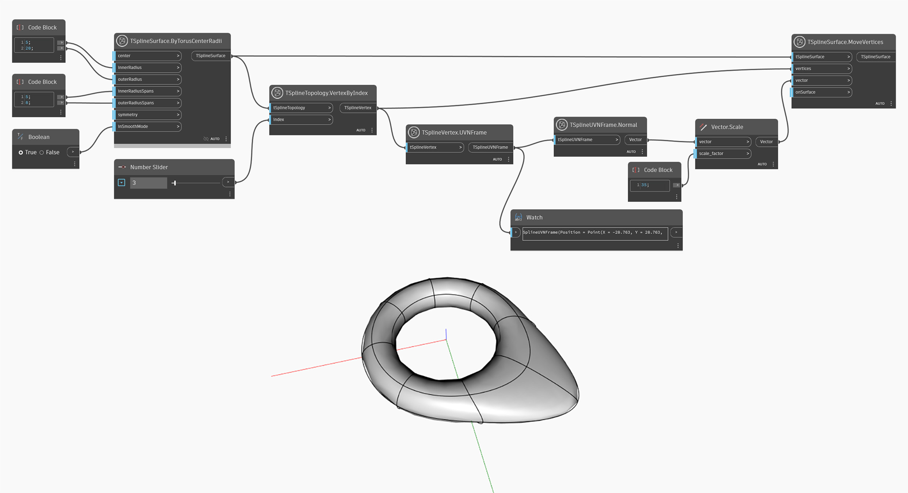

## In-Depth
此节点返回一个 TSplineUVNFrame 对象，该对象对于可视化顶点位置和方向以及使用 U 向量、V 向量或 N 向量进一步操纵 T-Spline 曲面非常有用。

在下面的示例中，`TSplineVertex.UVNFrame` 节点用于获取选定顶点的 UVN 框架。然后，UVN 框架用于返回顶点的法线。最后，法线方向用于使用 `TSplineSurface.MoveVertices` 节点移动顶点。

## 示例文件

