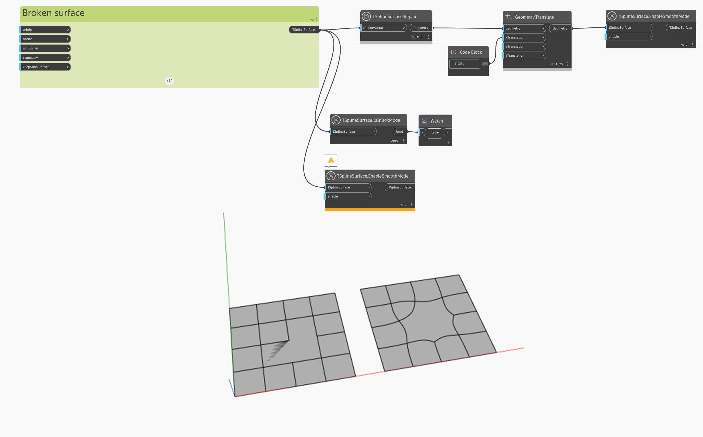

## 详细
在下面的示例中，T-Spline 曲面变为无效，这可以通过在背景预览中注意到重叠的面来观察到。曲面无效的事实可以通过使用 `TSplineSurface.EnableSmoothMode` 节点激活平滑模式失败来确认。另一条线索是 `TSplineSurface.IsInBoxMode` 节点返回 `true`，即使曲面最初已激活平滑模式。

为了修复曲面，通过 `TSplineSurface.Repair` 节点传递它。结果是一个有效的曲面，这可以通过成功启用平滑预览模式来确认。
___
## 示例文件

