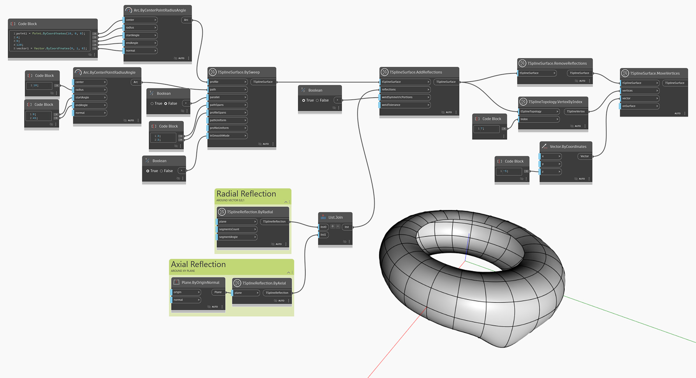

<!--- Autodesk.DesignScript.Geometry.TSpline.TSplineSurface.RemoveReflections --->
<!--- B6UBJT6X5TJMS4P6CSS7JRJI6HDOCJMIND4VHXATYF2L5IPVPQBQ --->
## In-Depth
`TSplineSurface.RemoveReflections` 从 `tSplineSurface` 输入中删除反射。删除反射不会修改形状，但会断开几何图形的反射部分之间的依存关系，从而允许单独编辑它们。

在下面的示例中，先通过应用轴向和径向反射创建一个 T-Spline 曲面。然后，该曲面传递给 `TSplineSurface.RemoveReflections` 节点，从而删除反射。为了说明这如何影响以后的更改，使用 `TSplineSurface.MoveVertex` 节点移动其中一个顶点。由于反射从曲面中删除，因此仅修改一个顶点。

## 示例文件

