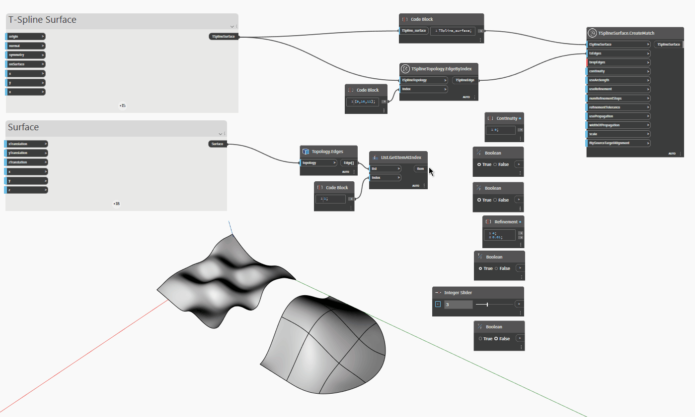

## 详细

在下面的示例中，使用 `TSplineSurface.CreateMatch(tSplineSurface,tsEdges,brepEdges)` 节点将 T-Spline 曲面与 BRep 曲面的边匹配。该节点所需的最小输入是基础 `tSplineSurface`、在 `tsEdges` 输入中提供的曲面的一组边以及在 `brepEdges` 输入中提供的边或边列表。以下输入控制匹配的参数:
- `continuity` 允许设置匹配的连续性类型。输入需要值 0、1 或 2，对应于 G0 位置、G1 切线和 G2 曲率连续性。
- `useArcLength` 控制路线类型选项。如果设置为 True，则使用的路线类型是“弧长”。此路线最大程度地减少 T-Spline 曲面的每个点和曲线上相应点之间的物理距离。当提供 False 输入时，路线类型是“参数化”- T-Spline 曲面上的每个点都与沿匹配目标曲线的可比参数化距离的点匹配。
- `useRefinement`，当设置为 True 时，将控制点添加到曲面以尝试在给定的 `refinementTolerance` 内匹配目标
- `numRefinementSteps` is the maximum number of times that the base T-Spline surface is subdivided
while attempting to reach `refinementTolerance`. Both `numRefinementSteps` and `refinementTolerance` will be ignored if the `useRefinement` is set to False.
- `usePropagation` controls how much of the surface is affected by the match. When set to False, the surface is minimally affected. When set to True, the surface is affected within the provided `widthOfPropagation` distance.
- `scale` is the Tangency Scale which affects results for G1 and G2 continuity.
- `flipSourceTargetAlignment` reverses the alignment direction.

## 示例文件

