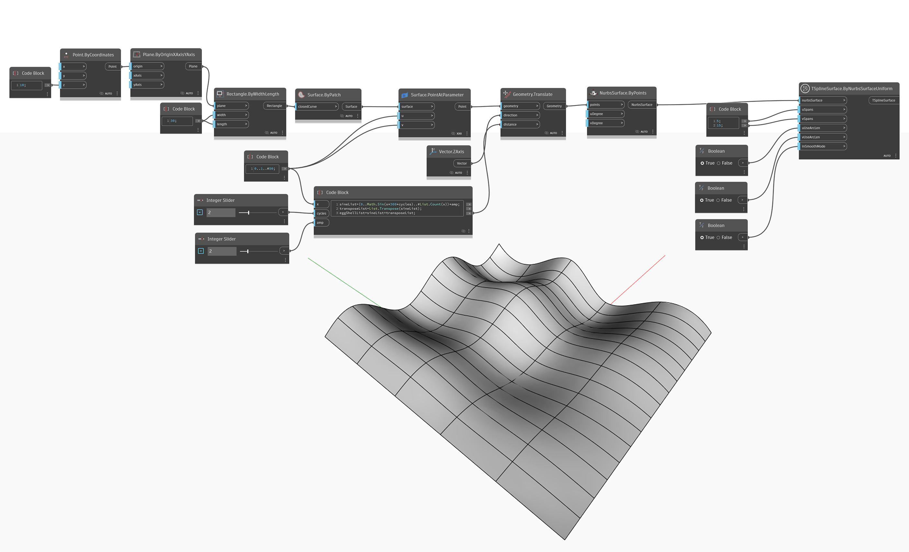

<!--- Autodesk.DesignScript.Geometry.TSpline.TSplineSurface.ByNurbsSurfaceUniform --->
<!--- C4KTVIQMR24V34QUQQ3FENYOOIOHKLUQ3SSJL3SVKQ2Z4QHWN4ZQ --->
## 详细
在下面的示例中，使用 `TSplineSurface.ByNurbsSurfaceUniform` 节点将 3 阶 的 NURBS 曲面转换为 T-Spline 曲面。根据相应的 `uUseArcLen` 和 `vUseArcLen` 输入，使用以相等参数化或弧长间隔放置的统一结重建输入 NURBS 曲面，并通过 3 阶 NURBS 曲面进行近似。输出 T-Spline 按给定的 `uSpan` 和 `vSpan` 计数在 U 和 V 方向上进行分割。

## 示例文件

