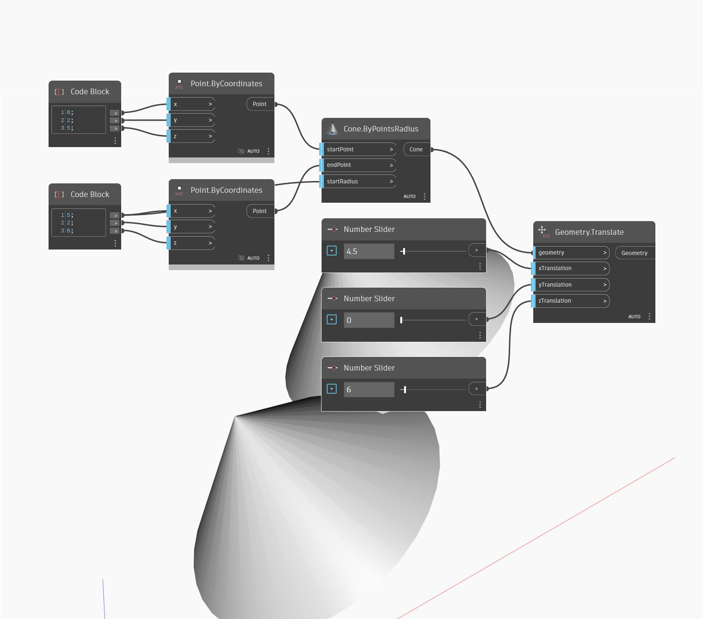

<!--- Autodesk.DesignScript.Geometry.Geometry.Translate(xTranslation, yTranslation, zTranslation) --->
<!--- CAQVXZBP5BJQVX7OKQYBMFD4SIBKAOGY3GDMXALYEEBP4UKHEUMQ --->
## 详细
将任意给定几何图形按给定位移朝 WCS 中定义的 X、Y、Z 方向分别平移。
___
## 示例文件

