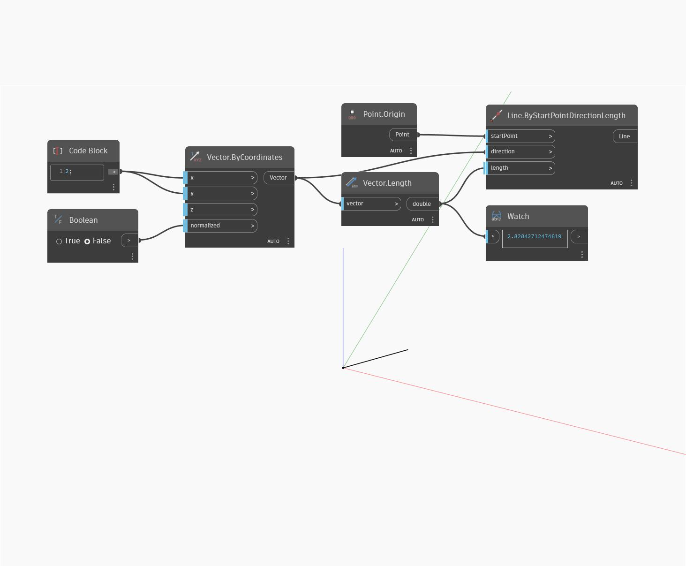

<!--- Autodesk.DesignScript.Geometry.Vector.ByCoordinates(x, y, z, normalized) --->
<!--- D37XBKNJBX5AZGHXPUHHK5DDGNDHLDGPI2QPK63TZHRZVREQ6MNA --->
## 详细
“ByCoordinates (x, y, z, normalized)”将基于坐标值和规格化布尔切换返回一个向量。在下例中，将返回一个长度为 2.83 的向量，该长度可规格化为 1。向量表示为直线，以显示切换规格化时的长度变化。
___
## 示例文件

