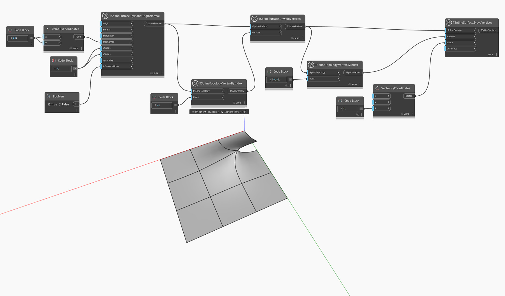

<!--- Autodesk.DesignScript.Geometry.TSpline.TSplineSurface.UnweldVertices --->
<!--- D6ESVRBW5SSM4F7J65W7OKR5DTKJAFW5F5AP23FRRR3MGXKIFVOQ --->
## In-Depth
类似于 `TSplineSurface.UnweldEdges`，此节点对一组顶点执行拆分操作。结果，在选定顶点处连接的所有边都进行拆分。与在保持连接的同时在顶点周围创建尖锐过渡的“取消锐化”操作不同，“取消锐化”会创建不连续性。

在下面的示例中，使用 `TSplineSurface.UnweldVertices` 节点拆分 T-Spline 平面的一个选定顶点。沿所选顶点周围的边引入不连续性，这通过使用 `TSplineSurface.MoveVertices` 节点向上拉动顶点来说明。

## 示例文件

