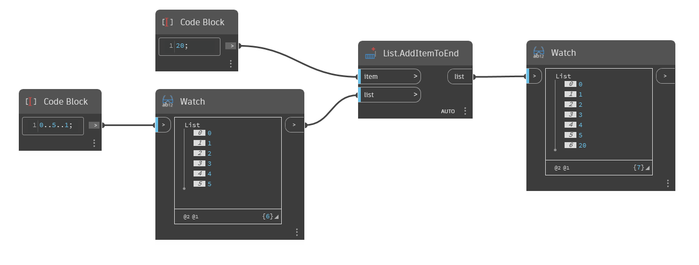

## 详细
`List.AddItemtoEnd` 将给定项插入到给定列表的末尾。请注意，如果将一个列表对象用作要添加的项，则整个列表将作为单个对象添加，从而生成嵌套列表。要将两个列表合并为一个平面列表，请参见 `List.Join`。

在下面的示例中，我们使用代码块生成从 0 到 5 (步长为 1)的一组数字。然后，我们使用 `List.AddItemToEnd` 将一个新的项(即数字 20)添加到该列表的末尾。
___
## 示例文件

