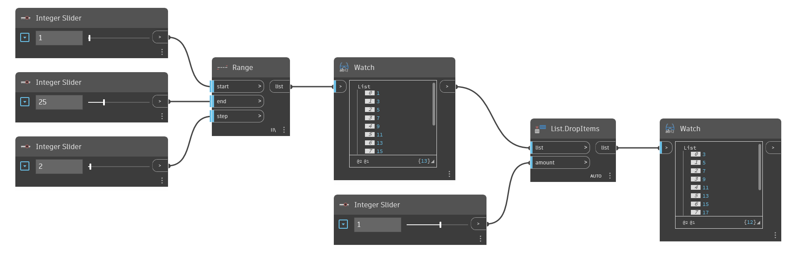

## 详细
`List.DropItems` 从列表中删除 `amount` 输入指定的项数。如果 `amount` 输入为正数，则从列表开头删除列表项。如果 `amount` 输入为负数，则从列表末尾删除列表项。

在下面的示例中，我们先使用 `Range` 创建一个列表，然后使用 `List.DropItems` (`amount` 输入为 1)从列表中删除第一项。由于 `amount` 输入为正数，因此将从列表开头删除列表项。
___
## 示例文件

