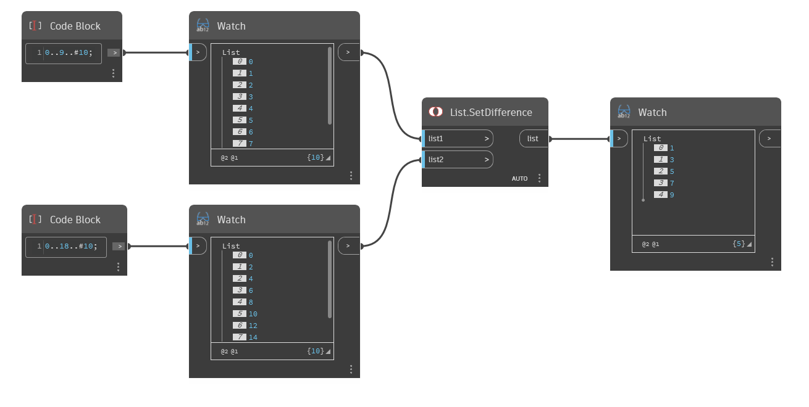

## 详细
`List.SetDifference` 返回一个新列表，其中仅包含 list1 中不存在于 list2 中的对象。

在下面的示例中，将一个列表(从 0 到 9，步长为 1)与另一个列表(从 0 到 18，步长为 2)进行比较。`List.SetDifference` 返回小于 10 的奇数，因为这些奇数仅包含在 List1 中但不包含在 List2 中。
___
## 示例文件

