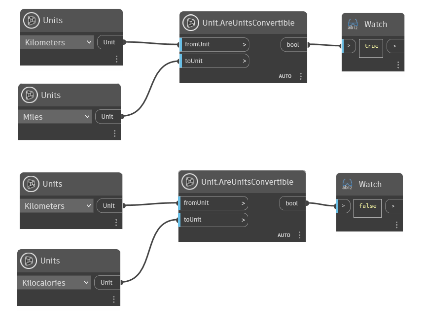

## 详细
`Unit.AreUnitsConvertible` 将需要两个单位输入，并确定第一个单位是否可以转换为第二个单位。如果单位可以转换，则返回 True；如果不能，则返回 False。

在下面的示例中，我们将使用 `Unit.AreUnitsConvertible` 来先确定公里是否可以转换为英里。这些单位是可转换的，因此返回 True。在第二种情况下，公里不能转换为千卡，因此返回 False。
___
## 示例文件

