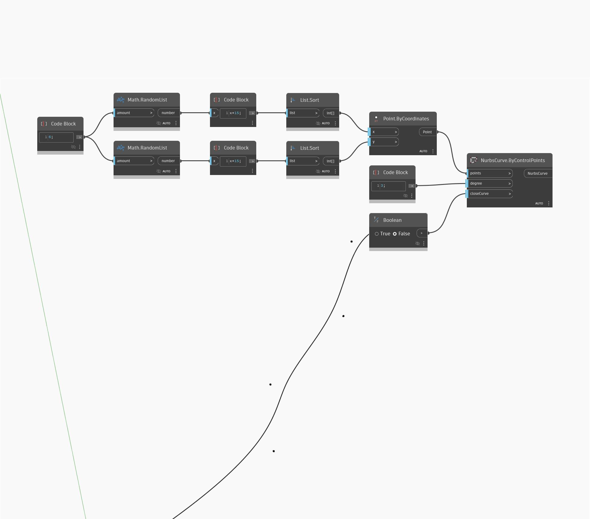

<!--- Autodesk.DesignScript.Geometry.NurbsCurve.ByControlPoints(points, degree, closeCurve) --->
<!--- EEK2MZQNIS3F4JP5TCEY6FFPZJ6INBUWD2P7FWPXS6O7IBVMTZCQ --->
## 详细
“Nurbs Curve By Control Points”将输入控制点列表以绘制 Nurbs 曲线，还允许我们控制曲线的阶数。我们还可以选择将曲线闭合回列表中的第一个点。本例在世界 XY 平面上生成四个随机点，然后在 X 和 Y 方向上依次连接它们。
___
## 示例文件

